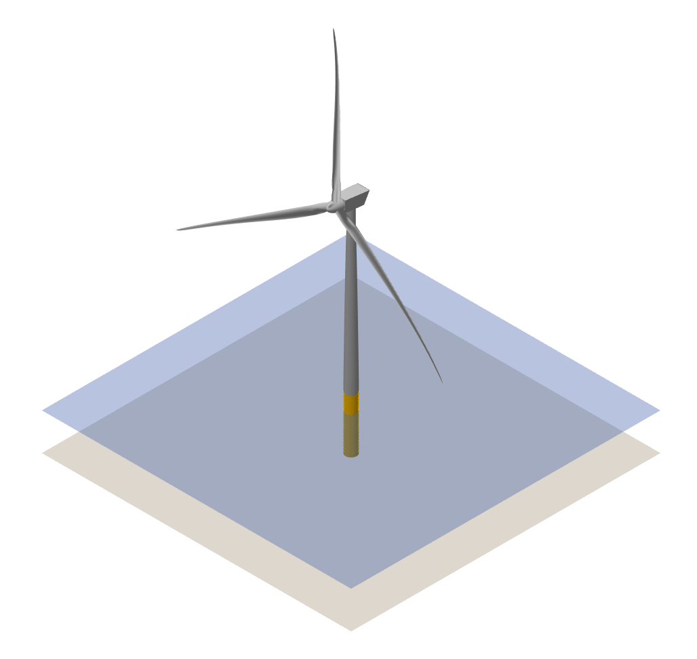

# IEA 22 MW RWT QBlade Models

To load a turbine model into QBlade, open the *Blade Design Module* and select *Turbine Definition -> Import Data -> Import Turbine Definition from a Text (.trb) File* from the top menu.

## Requirements:

 - QBlade 2.0.7 (or later) available from [QBlade.org](https://qblade.org/downloads/)
 
<figure>
  >
  <figcaption> IEA-22-280-RWT-Monopile </figcaption>
</figure>

 
